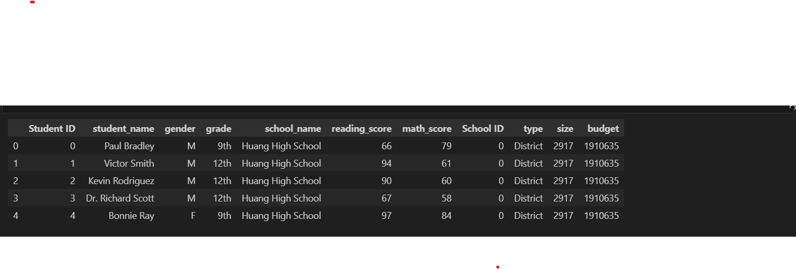
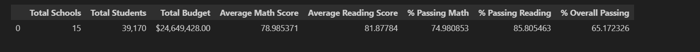
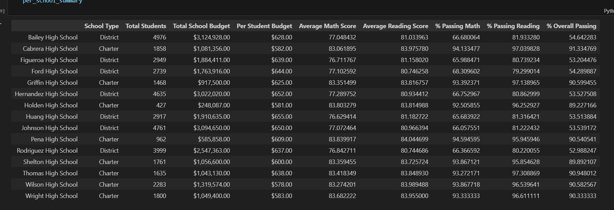
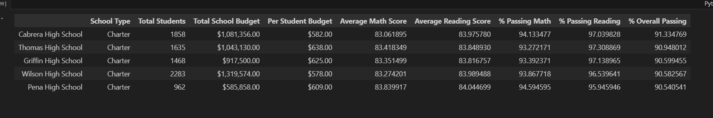
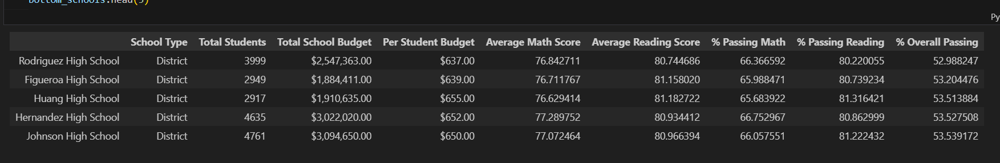
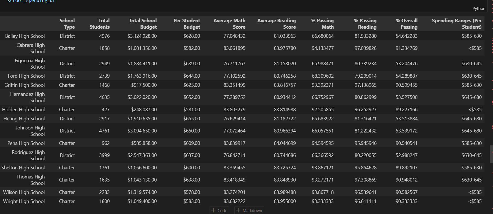
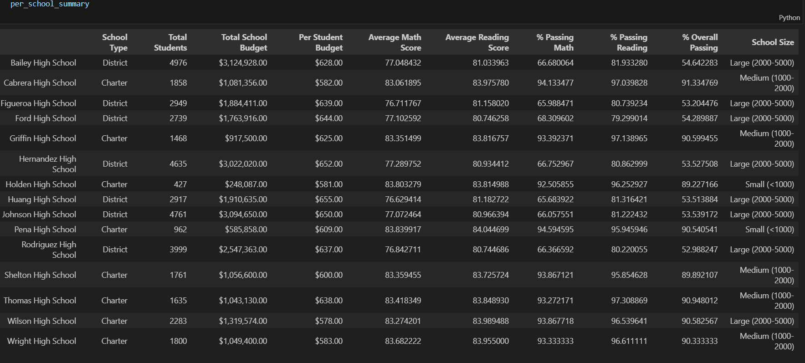
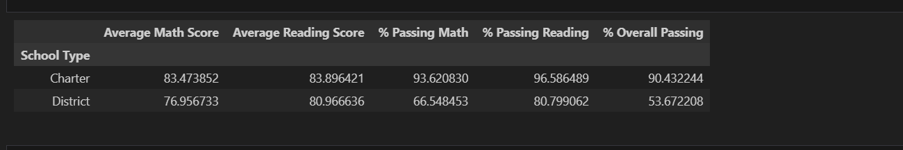

# # PyCity Schools Analysis
 - The overall passing percentage is higher in Charter type of school in comparision to District type of school. 
 - The highest performing school which is Charter type school has lower per student budget/spending but the overall passing percentage is high in comparison to  District type of school.
 - The overall math and reading scores by grades are consistent for all of the schools
 - The lower the overall Spending Ranges Per Student the higher the overall passing percentage 
 - Larger the school size lower the overall passing percent and lower the Average math and reading scores whereas Medium and small size school has higher the overall passing percent and higher the Average Math and reading scores
 - The Average math score and Average reading score is higher in charter type of school in comparison to district type of school
 - The percentage passing math and percent passing reading are higher in charter type school in comparison to district type of school
 - Highest Performing school is charter type of school the top 5 schools
 - Lower Performing school is district type of school the bottom 5 schools
 ---------------------------------------------------------------------------------------------------------------------------------------------------------------

# Dependencies and Setup
import pandas as pd
from pathlib import Path

# File to Load (Remember to Change These)
school_data_to_load = Path("Resources/schools_complete.csv")
student_data_to_load = Path("Resources/students_complete.csv")

# Read School and Student Data File and store into Pandas DataFrames
school_data = pd.read_csv(school_data_to_load)
student_data = pd.read_csv(student_data_to_load)

# Combine the data into a single dataset.  
school_data_complete = pd.merge(student_data, school_data, how="left", on=["school_name", "school_name"])
school_data_complete.head()

# District Summary

# Calculate the total number of unique schools
school_count = school_data_complete["school_name"].unique()
school_count = pd.Series(school_count).count()
school_count

...15

# Calculate the total number of students

student_count = school_data_complete.shape[0]
student_count

...39170

# Calculate the total budget

...24649428

total_budget = school_data["budget"].sum()
total_budget

...24649428

# Calculate the average (mean) math score
average_math_score = student_data["math_score"].mean()
average_math_score

...78.98537145774827

# Calculate the average (mean) reading score
average_reading_score = student_data["reading_score"].mean()
average_reading_score

...81.87784018381414

# Use the following to calculate the percentage of students who passed math (math scores greather than or equal to 70)
passing_math_count = school_data_complete[(school_data_complete["math_score"] >= 70)].count()["student_name"]
passing_math_percentage = passing_math_count / float(student_count) * 100
passing_math_percentage

...74.9808526933878

# Calculate the percentage of students who passed reading (hint: look at how the math percentage was calculated)  
passing_reading_count = school_data_complete[(school_data_complete["reading_score"] >= 70)].count()["student_name"]
passing_reading_percentage = passing_reading_count / float(student_count) * 100
passing_reading_percentage

# Use the following to calculate the percentage of students that passed math and reading
passing_math_reading_count = school_data_complete[
    (school_data_complete["math_score"] >= 70) & (school_data_complete["reading_score"] >= 70)
].count()["student_name"]
overall_passing_rate = passing_math_reading_count /  float(student_count) * 100
overall_passing_rate

...65.17232575950983

# Create a high-level snapshot of the district's key metrics in a DataFrame

#Total Schools	Total Students	Total Budget	Average Math Score	Average Reading Score	% Passing Math	% Passing Reading	% Overall Passing
district_summary = pd.DataFrame({"Total School": [school_count],
                              "Total Students": student_count,
                              "Total Budget": total_budget,
                              "Average Math Score": average_math_score,
                              "Average Reading Score": average_reading_score, 
                              "% Passing Math": passing_math_percentage, 
                              "% Passing Reading": passing_reading_percentage,
                              "% Overall Passing": overall_passing_rate}) 

# Formatting
district_summary["Total Students"] = district_summary["Total Students"].map("{:,}".format)
district_summary["Total Budget"] = district_summary["Total Budget"].map("${:,.2f}".format)

# Display the DataFrame
district_summary

# School Summary

# Use the code provided to select all of the school types
school_types = school_data.set_index(["school_name"])["type"]

school_types

# Calculate the total student count per school

per_school_counts = school_data_complete["school_name"].value_counts()
per_school_counts

# Calculate the total school budget and per capita spending per school
per_school_budget = school_data_complete.groupby("school_name")["budget"].mean()
per_school_budget
per_school_capita = per_school_budget /per_school_counts
per_school_capita

# Calculate the average test scores per school
per_school_math = school_data_complete.groupby("school_name")["math_score"].mean()
per_school_math

per_school_reading = school_data_complete.groupby("school_name")["reading_score"].mean()
per_school_reading

# Use the provided code to calculate the number of students per school that passed both math and reading with scores of 70 or higher
per_passing_math_and_reading = student_data[
    (student_data["reading_score"] >= 70) & (student_data["math_score"] >= 70)
]
per_passing_math_and_reading = per_passing_math_and_reading.groupby(["school_name"]).size()
per_passing_math_and_reading

# Calculate the number of students per school with math scores of 70 or higher

student_passing_math = student_data[student_data["math_score"] >= 70]
school_students_passing_math = student_passing_math.groupby("school_name")["student_name"].count()
school_students_passing_math

# Calculate the number of students per school with reading scores of 70 or higher
student_passing_reading = student_data[student_data["reading_score"] >= 70]
school_students_passing_reading = student_passing_reading.groupby("school_name")["student_name"].count()
school_students_passing_reading

# Use the provided code to calculate the number of students per school that passed both math and reading with scores of 70 or higher
students_passing_math_and_reading = student_data[
    (student_data["reading_score"] >= 70) & (student_data["math_score"] >= 70)
]
school_students_passing_math_and_reading = students_passing_math_and_reading.groupby(["school_name"]).size()
school_students_passing_math_and_reading

# code to calculate the school students passing math and reading rates
school_students_passing_math_and_reading  = per_passing_math_and_reading/ per_school_counts  * 100
school_students_passing_math_and_reading

# Use the provided code to calculate the passing rates
per_school_passing_math = school_students_passing_math/ per_school_counts * 100
per_school_passing_math

# calculate per school passing reading rates
per_school_passing_reading = school_students_passing_reading/ per_school_counts * 100
per_school_passing_reading

# Create a DataFrame called `per_school_summary` with columns for the calculations above.
per_school_summary =pd.DataFrame({"School Type": school_types, 
                      "Total Students": per_school_counts, 
                      "Total School Budget": per_school_budget, 
                      "Per Student Budget": per_school_capita,
                      "Average Math Score": per_school_math,
                      "Average Reading Score": per_school_reading, 
                      "% Passing Math": per_school_passing_math, 
                      "% Passing Reading": per_school_passing_reading, 
                      "% Overall Passing": school_students_passing_math_and_reading})
#per_school_summary = (per_school_summary)
# Formatting
per_school_summary["Total School Budget"] = per_school_summary["Total School Budget"].map("${:,.2f}".format)
per_school_summary["Per Student Budget"] = per_school_summary["Per Student Budget"].map("${:,.2f}".format)

# Display the DataFrame
per_school_summary

# Highest-Performing Schools (by % Overall Passing)

# Sort the schools by `% Overall Passing` in descending order and display the top 5 rows.
top_schools = per_school_summary.sort_values("% Overall Passing",ascending=False)
top_schools.head(5)  

# Bottom Performing Schools (By % Overall Passing)

# Sort the schools by `% Overall Passing` in ascending order and display the top 5 rows.
bottom_schools = per_school_summary.sort_values("% Overall Passing",ascending=True)
bottom_schools.head(5)

# Math Scores by Grade

# Use the code provided to separate the data by grade
ninth_graders = school_data_complete.loc[school_data_complete["grade"] == "9th"] 
tenth_graders = school_data_complete.loc[(school_data_complete["grade"] == "10th")]
eleventh_graders = school_data_complete[(school_data_complete["grade"] == "11th")]
twelfth_graders = school_data_complete[(school_data_complete["grade"] == "12th")]

# Group by `school_name` and take the mean of the `math_score` column for each.
ninth_grade_math_scores =  ninth_graders.groupby(["school_name"])["math_score"].mean()
tenth_grader_math_scores = tenth_graders.groupby(["school_name"])["math_score"].mean()
eleventh_grader_math_scores = eleventh_graders.groupby(["school_name"])["math_score"].mean()
twelfth_grader_math_scores = twelfth_graders.groupby(["school_name"])["math_score"].mean()

# Combine each of the scores above into single DataFrame called `math_scores_by_grade`
math_scores_by_grade = pd.DataFrame({"9TH":ninth_grade_math_scores,
                                     "10TH":tenth_grader_math_scores,
                                     "11TH":eleventh_grader_math_scores,
                                     "12TH": twelfth_grader_math_scores
                                     })

# Display the DataFrame
math_scores_by_grade

# Reading Score by Grade 

# Use the code provided to separate the data by grade
ninth_graders = school_data_complete[(school_data_complete["grade"] == "9th")]
tenth_graders = school_data_complete[(school_data_complete["grade"] == "10th")]
eleventh_graders = school_data_complete[(school_data_complete["grade"] == "11th")]
twelfth_graders = school_data_complete[(school_data_complete["grade"] == "12th")]

# Group by `school_name` and take the mean of the the `reading_score` column for each.
ninth_grade_reading_scores = ninth_graders.groupby(["school_name"])["reading_score"].mean()
tenth_grader_reading_scores = tenth_graders.groupby(["school_name"])["reading_score"].mean()
eleventh_grader_reading_scores = eleventh_graders.groupby(["school_name"])["reading_score"].mean()
twelfth_grader_reading_scores = twelfth_graders.groupby(["school_name"])["reading_score"].mean()

# Combine each of the scores above into single DataFrame called `reading_scores_by_grade`
reading_scores_by_grade = pd.DataFrame({"9TH":ninth_grade_reading_scores,
                                     "10TH":tenth_grader_reading_scores,
                                     "11TH":eleventh_grader_reading_scores,
                                     "12TH": twelfth_grader_reading_scores
                                     })

# Display the DataFrame
reading_scores_by_grade

# Scores by School Spending

# Establish the bins 
spending_bins = [0, 585, 630, 645, 680]
labels = ["<$585", "$585-630", "$630-645", "$645-680"]

# Create a copy of the school summary since it has the "Per Student Budget" 
school_spending_df = per_school_summary.copy()

# Use `pd.cut` to categorize spending based on the bins.
school_spending_df["Spending Ranges (Per Student)"] = pd.cut(per_school_capita, spending_bins,labels=labels)

school_spending_df

# Calculate averages for the desired columns. 
spending_math_scores = school_spending_df.groupby(["Spending Ranges (Per Student)"])["Average Math Score"].mean()
spending_reading_scores = school_spending_df.groupby(["Spending Ranges (Per Student)"])["Average Reading Score"].mean()
spending_passing_math = school_spending_df.groupby(["Spending Ranges (Per Student)"])["% Passing Math"].mean()
spending_passing_reading = school_spending_df.groupby(["Spending Ranges (Per Student)"])["% Passing Reading"].mean()
overall_passing_spending = school_spending_df.groupby(["Spending Ranges (Per Student)"])["% Overall Passing"].mean()

# Assemble into DataFrame
spending_summary =pd.DataFrame({"Average Math Score": spending_math_scores,
                               "Average Reading Score": spending_reading_scores,
                               "% Passing Math": spending_passing_math,
                                "% Passing Reading": spending_passing_reading,
                                "% Overall Passing": overall_passing_spending})
# Display results
spending_summary

# Scores by School Size

# Establish the bins.
size_bins = [0, 1000, 2000, 5000]
labels = ["Small (<1000)", "Medium (1000-2000)", "Large (2000-5000)"]

# Categorize the spending based on the bins
# Use `pd.cut` on the "Total Students" column of the `per_school_summary` DataFrame.

per_school_summary["School Size"] = pd.cut(per_school_counts,bins=size_bins,labels=labels)
type_summary = per_school_summary.copy()
type_summary

# Calculate averages for the desired columns. 
size_math_scores = per_school_summary.groupby(["School Size"])["Average Math Score"].mean()
size_reading_scores = per_school_summary.groupby(["School Size"])["Average Reading Score"].mean()
size_passing_math = per_school_summary.groupby(["School Size"])["% Passing Math"].mean()
size_passing_reading = per_school_summary.groupby(["School Size"])["% Passing Reading"].mean()
size_overall_passing = per_school_summary.groupby(["School Size"])["% Overall Passing"].mean()

# Create a DataFrame called `size_summary` that breaks down school performance based on school size (small, medium, or large).
# Use the scores above to create a new DataFrame called `size_summary`
size_summary = pd.DataFrame({"Average Math Score":size_math_scores,
                             "Average Reading Score": size_reading_scores,
                             "% Passing Math":size_passing_math,
                             "% Passing Reading":size_passing_reading,
                             "% Overall Passing":size_overall_passing})

# Display results
size_summary

# Scores by School Type

# Group the per_school_summary DataFrame by "School Type" and average the results.
average_math_score_by_type = per_school_summary.groupby(["School Type"])["Average Math Score"].mean()
average_reading_score_by_type = per_school_summary.groupby(["School Type"])["Average Reading Score"].mean()
average_percent_passing_math_by_type = per_school_summary.groupby(["School Type"])["% Passing Math"].mean()
average_percent_passing_reading_by_type = per_school_summary.groupby(["School Type"])["% Passing Reading"].mean()
average_percent_overall_passing_by_type = per_school_summary.groupby(["School Type"])["% Overall Passing"].mean()

# Assemble the new data by type into a DataFrame called `type_summary`
type_summary = pd.DataFrame({"Average Math Score": average_math_score_by_type,
                               "Average Reading Score": average_reading_score_by_type ,
                               "% Passing Math": average_percent_passing_math_by_type,
                                "% Passing Reading":average_percent_passing_reading_by_type,
                                "% Overall Passing": average_percent_overall_passing_by_type})

# Display results
type_summary

